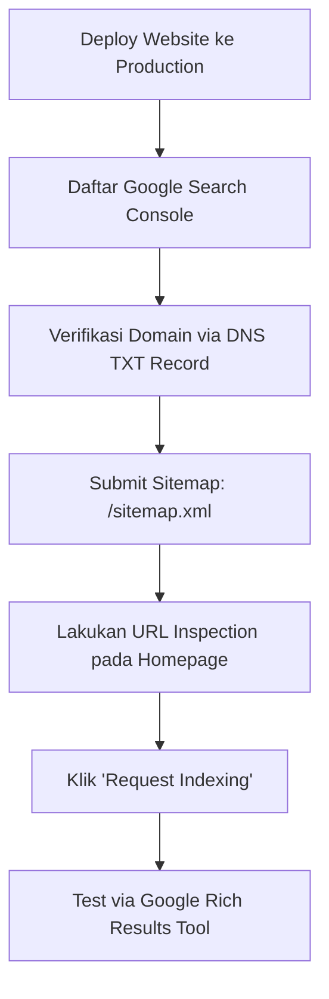

# 🚀 Blue Print & Rencana Penyesuaian SEO Arsalynk

> **Catatan 8 Oktober 2026:** bagian tentang *Sitelinks Search Box*, estimasi pasti peringkat, dan pemunculan Knowledge Panel di bawah adalah blueprint historis, bukan janji hasil. Google menghentikan Sitelinks Search Box pada 21 November 2024. Lihat `SEO_ENTITY_FIRST_2026.md` untuk implementasi terbaru dan checklist verifikasi.
> **Target:** Membangun struktur pencarian Google tingkat enterprise (menyerupai *Apple / Stripe / Microsoft*): Brand Snippet, Expanded 6-Pack Sitelinks, Sitelinks Searchbox, serta Google Knowledge Panel.

---

## 📌 1. Target Tampilan SERP (Google Search Result)

Untuk mencapai tampilan pencarian Google yang mendominasi halaman pertama saat seseorang mencari keyword **"Arsalynk"** atau **"Arsalynk Software House"**, terdapat 4 pilar visual utama:

```
+-----------------------------------------------------------------------+
|  [Icon] Arsalynk  https://www.arsalynk.com                            |
|  Arsalynk - Modern Software House & Digital Product Studio            |
|  Solusi rekayasa perangkat lunak, sistem AI, web & mobile app enterprise... |
|                                                                       |
|  [  🔍 Cari di arsalynk.com...                      ] [ Search ]      |  <-- Sitelinks Searchbox
|                                                                       |
|  Our Works                            Our Solution                    |
|  Eksplorasi portofolio & proyek...    Layanan web, mobile app & AI... |
|                                                                       |
|  About Us                             Our Business                    |
|  Mengenal visi, misi & tim kami...    Ekosistem bisnis & kemitraan... |
|                                                                       |
|  Contact Us                           Insight & Programs              |
|  Konsultasi proyek digital Anda...    Artikel, inovasi & studi kasus..|  <-- 6-Pack Sitelinks
+-----------------------------------------------------------------------+
|  KNOWLEDGE PANEL (Sisi Kanan Desktop / Bagian Atas Mobile)            |
|  [Logo Arsalynk]                                                      |
|  Arsalynk                                                             |
|  Perusahaan Perangkat Lunak di Jakarta                                |
|  Kantor Pusat: Jakarta, Indonesia                                     |
|  Didirikan: 202X                                                      |
|  Profil Media Sosial: LinkedIn | Instagram | Facebook | GitHub        |  <-- Knowledge Graph
+-----------------------------------------------------------------------+
```

---

## 🏗️ 2. Arsitektur Teknis (Next.js App Router)

Implementasi teknis di codebase Arsalynk memanfaatkan fitur native Next.js 14+ (Metadata API, Dynamic Sitemap, Robots Generator, dan Structured JSON-LD).

### 2.1 Schema JSON-LD Hierarchy
Schema adalah "bahasa data" yang dibaca oleh robot Google (Googlebot) untuk memahami entitas bisnis:

1. **`Organization` & `Corporation` (Entity Root):**
   - Mendefinisikan legal identity, logo resmi, nama alias, pendiri, kontak, dan link media sosial (`sameAs`).
   - Lokasi: `app/page.tsx`
2. **`WebSite` + `SearchAction` (Sitelinks Searchbox):**
   - Memberitahu Google bahwa web memiliki fitur search internal yang siap ditampilkan langsung di bawah cuplikan hasil pencarian.
   - Lokasi: `app/page.tsx`
3. **`SiteNavigationElement` + `ItemList` (Direct Sitelinks Trigger):**
   - Memberikan petunjuk struktur menu utama yang direkomendasikan menjadi sub-links (Our Works, About Us, Our Solution, Our Business, Contact Us, Insights).
   - Lokasi: `app/page.tsx` dan layout masing-masing sub-halaman.
4. **`LocalBusiness` / `ProfessionalService`:**
   - Menghubungkan website dengan koordinat fisik, jam operasional, alamat kantor, dan Google Maps.
   - Lokasi: `app/contact-us/layout.tsx`

### 2.2 Metadata API & OpenGraph Standard
Setiap halaman wajib memiliki:
- **Title Tag Dinamis:** Format `%s | Arsalynk - Software House & Digital Studio`
- **Meta Description:** 150-160 karakter yang persuasif, mengandung USP (Unique Selling Proposition).
- **Canonical URL:** Mencegah isu duplikasi URL (`canonical: 'https://www.arsalynk.com/...'`).
- **OpenGraph & Twitter Card:** Gambar banner `og:image` rasio 1200x630 pixel untuk preview saat dibagikan di WhatsApp, LinkedIn, dan Twitter/X.

### 2.3 File Penunjang Indexing
- **`app/sitemap.ts`:** Sitemap XML dinamis yang mengelompokkan halaman prioritas:
  - Homepage (`1.0`)
  - Layanan & Portofolio (`0.85 - 0.90`)
  - About & Contact (`0.80`)
  - Sub-kategori Insight/Case Studies (`0.70 - 0.75`)
- **`app/robots.ts`:** Mengatur akses crawler Googlebot dan AdsBot serta memblokir file private/internal (`/_next/`, `/admin/`, API internal).

---

## 📝 3. Data Faktual yang Harus Disesuaikan (Project Checklist)

Pastikan file kode berikut disesuaikan dengan data riil Arsalynk:

### File: `app/page.tsx` & `app/contact-us/layout.tsx`
| Parameter | Nilai Default / Placeholder | Nilai Faktual yang Harus Diisi |
|---|---|---|
| `foundingDate` | `'2020'` | Tahun resmi berdirinya Arsalynk |
| `streetAddress` | `'Jl. Jenderal Sudirman'` | Alamat kantor lengkap & resmi |
| `postalCode` | `'10220'` | Kode pos kantor |
| `latitude` / `longitude` | `'-6.2088'` / `'106.8456'` | Koordinat GPS kantor dari Google Maps |
| `telephone` | `'+62-812-XXXX-XXXX'` | Nomor WhatsApp Business resmi |
| `email` | `'hello@arsalynk.com'` | Email resmi domain perusahaan |
| `sameAs` | Link Instagram, LinkedIn, FB | Lengkapi dengan semua kanal (Crunchbase, GitHub, YouTube jika ada) |

---

## 🌐 4. Strategi Off-Page & Pembentukan Knowledge Panel

Google tidak memunculkan Knowledge Panel hanya dari kode website saja; Google membutuhkan verifikasi konsistensi lintas platform (**Entity Authority**):

### Langkah 1: Google Business Profile (Wajib untuk Knowledge Box)
1. Buka [business.google.com](https://business.google.com/).
2. Buat profil bisnis: **Arsalynk**.
3. Pilih kategori: **Software Company** / **Konsultan Perangkat Lunak**.
4. Isi alamat kantor, jam kerja, nomor WhatsApp Business, dan link website `https://www.arsalynk.com`.
5. Unggah foto resolusi tinggi:
   - Logo Arsalynk (format persegi min 512×512px).
   - Foto kantor / ruang kerja / tim.
6. Lakukan verifikasi Google (biasanya melalui video call atau rekaman singkat).

### Langkah 2: Konsistensi NAP (Name, Address, Phone)
Google mencocokkan data di seluruh internet:
- **Nama Perusahaan:** Tetap konsisten "Arsalynk" (bukan berganti-ganti ejaan).
- **Alamat & Telepon:** Sama persis antara website, Google Business Profile, LinkedIn, dan akun media sosial.

### Langkah 3: Profil Perusahaan Resmi (Entity Citations)
Buat dan lengkapi profil di platform yang diakui Googlebot:
- **LinkedIn:** Halaman Perusahaan resmi (Company Page) dengan deskripsi industri IT.
- **Instagram & Facebook:** Akun bisnis resmi dengan bio mengarah ke website.
- **GitHub Organization:** `github.com/arsalynk` (meningkatkan otoritas tech entity).
- **Crunchbase:** Daftarkan startup/perusahaan di [crunchbase.com](https://www.crunchbase.com) (sinyal sangat kuat untuk Knowledge Graph).

---

## ⚙️ 5. Prosedur Launching & Verifikasi Google Search Console

Setelah website dideploy ke production domain (`arsalynk.com`):



### Panduan Langkah:
1. **Google Search Console (GSC):**
   - Buka [search.google.com/search-console](https://search.google.com/search-console/).
   - Tambahkan property tipe **Domain**: `arsalynk.com`.
   - Salin DNS TXT record ke DNS manager hosting/domain provider (Cloudflare/Niagahoster/Domainesia/dsb).
2. **Submit Sitemap:**
   - Masuk ke menu **Sitemaps** di GSC.
   - Masukkan `sitemap.xml` lalu klik **Submit**.
   - Pastikan statusnya berubah menjadi **Success** dengan jumlah URL terdeteksi.
3. **Rich Results Testing:**
   - Akses [search.google.com/test/rich-results](https://search.google.com/test/rich-results).
   - Masukkan `https://www.arsalynk.com`.
   - Validasi bahwa item: `Organization`, `WebSite`, `Sitelinks Searchbox`, dan `Breadcrumbs` terdeteksi hijau (Valid) tanpa error.

---

## ⏳ 6. Timeline & Fase Pertumbuhan SEO di Google

Hasil tampilan Google tidak instan, melainkan bertahap sesuai siklus perayapan (*crawling, indexing, & authority building*):

| Fase | Waktu Estimasi | Apa yang Terjadi di Google? |
|---|---|---|
| **Fase 1: Indexing Awal** | Hari ke 3 – 14 | Website mulai muncul di pencarian jika mencari URL spesifik atau nama brand lengkap. |
| **Fase 2: Brand Ranking** | Minggu ke 2 – 4 | Mencari kata kunci `"Arsalynk"` akan menempatkan website di peringkat 1 teratas. Snippet Title & Meta Description sudah rapi. |
| **Fase 3: Sitelinks & Searchbox** | Bulan ke 1 – 3 | Google mengumpulkan data interaksi pengunjung. Sub-menu navigasi (About Us, Our Works, Our Solution) mulai muncul di bawah hasil pencarian utama. |
| **Fase 4: Full Knowledge Panel** | Bulan ke 2 – 6 | Setelah verifikasi Google Business Profile aktif dan brand memiliki jejak digital (LinkedIn, sosmed, review klien), kotak Knowledge Graph di sisi kanan desktop akan tampil otomatis. |

---

## 📋 7. Action Plan Checklist Harian / Mingguan

### Tahap 1: Persiapan Teknis (Kode & Build)
- [x] Schema `Organization` & `WebSite` terpasang di `app/page.tsx`
- [x] Schema `SiteNavigationElement` terpasang untuk 6 menu utama
- [x] Schema per sub-halaman (`AboutPage`, `ContactPage`, `CollectionPage`, dsb)
- [x] Schema `CollectionPage` + `hasPart` di `insight-programs/layout.tsx` ✅ *baru*
- [x] Sitemap dinamis `app/sitemap.ts` aktif — tanggal `LAST_MODIFIED` diperbarui ke `2026-10-01` ✅ *baru*
- [x] Privacy policy ditambahkan ke sitemap ✅ *baru*
- [x] Konfigurasi `robots.ts` aktif — Googlebot, Bingbot, GPTBot, AdsBot diatur terpisah ✅ *baru*
- [x] Atribut `lang="id"` diperbaiki di `app/layout.tsx` (sebelumnya `lang="en"`) ✅ *baru*
- [x] Web Manifest diperkaya: `categories`, `shortcuts`, `scope`, `lang`, `purpose` ✅ *baru*
- [x] `our-solution/layout.tsx` — metadata export ditambahkan ✅ *baru*
- [x] `our-business/layout.tsx` — metadata export ditambahkan ✅ *baru*
- [ ] **Aktifkan `verification.google` di `app/layout.tsx`** dengan token GSC asli setelah mendaftar
- [ ] Ganti data dummy alamat, koordinat kantor di `app/page.tsx` dan `app/contact-us/layout.tsx` dengan data riil
- [ ] Build & deploy production tanpa lint/type error

### Tahap 2: Google & Eksternal Setup
- [ ] Registrasi properti domain di Google Search Console
- [ ] Submit `https://www.arsalynk.com/sitemap.xml` di GSC
- [ ] Daftarkan & verifikasi profil di Google Business Profile (Google Maps)
- [ ] Hubungkan link profil medsos resmi di schema `sameAs`
- [ ] Jalankan Rich Results Test untuk memastikan 0 error

### Tahap 3: Pemeliharaan & Otoritas
- [ ] Publikasikan minimal 1–2 artikel atau studi kasus per bulan di `/insight-programs`
- [ ] Dapatkan review bintang 5 di Google Business Profile dari klien nyata
- [ ] Perbarui sitemap secara otomatis saat ada proyek baru di `/our-works`
- [ ] Update `LAST_MODIFIED` di `sitemap.ts` setiap kali ada deploy besar
